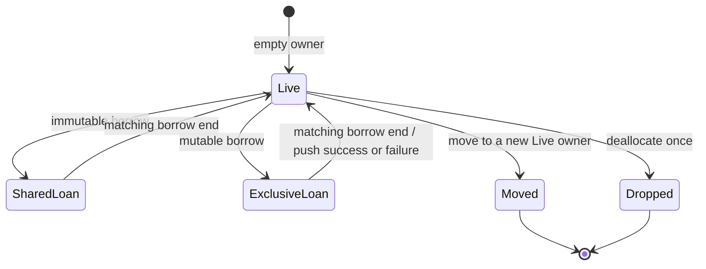

# Owned Byte Buffer Readiness Contract

Status: CAP-035 accepted readiness contract; R1A local candidate, 2026-08-15.

Accepted analysis base: CAP-032 merge
`ce70f795e17a2da10253048c587cb475582c3f50`, tree
`0464664982d90c5f76dc44001007b2ac7ffeee1c`.

Protected readiness checkpoint: CAP-035 candidate
`c50ae7c8ef92f910244f383363b811d8a37622f9` merged as
`da2ad95d4a1db3a991128a63223c82639d24ff2a`; both have tree
`fb4739291690efa5c940d929f69435b063ea67f6`, and all candidate plus
accepted-head workflows passed.

This document freezes the route from the accepted fixed-buffer compiler kernels
to R1's first owned runtime storage. It is a design and evidence contract, not an
implementation or allocation claim.

## Decision

R1 must not revive the historical generic Vec surface and must not be attempted
as one parser-to-runtime change. A complete source-visible buffer crosses more
than the repository's two-phase task limit: source admission, semantic ownership,
checked-IR production, independent verification, backend layout, runtime linking,
and cross-platform native evidence.

The smallest honest route is therefore three protected checkpoints:

1. **R1A — allocator runtime ABI:** add the replaceable runtime/link boundary and
   deterministic allocator test implementation without admitting source syntax.
2. **R1B — checked owned-byte resource:** add dedicated checked IR, lifecycle and
   loan verification, and backend lowering without admitting source syntax.
3. **R1C — source/profile slice:** add the bounded `ByteBuffer` source surface,
   semantic ownership, checked-IR production, and a new fail-closed profile that
   consumes R1A and R1B.

Only the protected acceptance of all three closes R1.

## Why the existing Vec names are not a starting implementation

| Existing surface | Accepted behavior | Consequence |
|---|---|---|
| `Vec::new()` | Parsed as the ordinary `Name::Variant` enum form and rejected with ``Semantic Analysis Error: enum `Vec` has no unique admitted definition`` | There is no collection-constructor syntax or semantic identity |
| `vec![]` | `parse_vec_macro_literal` erases it into an array literal; the empty form is rejected because no logical element type can be admitted | It is not owned or growable storage |
| `Ty::Vec` | Retained by compatibility type conversion and a zero-argument `.iter()` identity path | A type name alone supplies no allocation, initialized-range, or destruction rules |
| `Inst::Vec*` | Every instruction is rejected by the checked verifier and backend | They cannot enter trusted LLVM generation |
| `stdlib::VecType` | Uses fixed registers, panics, floating-point comparisons, and simplified placeholder operations | It is preserved historical/experimental code, not an authority to extend |
| LLVM backend | Declares `printf` and conditional `llvm.trap` only | No allocator/deallocator or runtime-object link contract exists |

The two exact source probes are stored only under `D:\Aero-temp\cap-035`; they
are not product files or evidence of a supported feature.

## Frozen source boundary

The initial source owner is exactly `ByteBuffer`. It is neither `Vec<int>` nor a
generic collection. The first API is intentionally a set of free intrinsic
functions so R1 does not invent a new `Type::method` parser meaning:

```aero
bytes_new() -> ByteBuffer
bytes_push(&mut ByteBuffer, int) -> Result<int, int>
bytes_len(&ByteBuffer) -> int
bytes_capacity(&ByteBuffer) -> int
bytes_get(&ByteBuffer, int) -> Result<int, int>
```

The future selected profile is reserved as
`exact-i32-byte-buffer-v0`. It composes the accepted exact integer,
record/Result, exhaustive Match, and control-flow surface with only this buffer
API. Existing profiles remain unchanged.

The R1C slice initially admits:

- function-local owners;
- local-to-local moves outside conditional/loop topology;
- one outer live owner used inside admitted loops;
- immediate, non-escaping immutable aliases for length/capacity/get;
- immediate, non-escaping exclusive aliases for push; and
- compiler-inserted destruction on reachable function return or fallthrough.

It excludes buffer parameters and results, globals, captures, stored aliases,
conditional or loop-local owner creation/move/drop, and buffers inside records,
arrays, tuples, enums, carriers, generic applications, or public ABI.

## Logical and physical invariants

One logical byte is a source `int` in `0..=255` and one physical `i8` after the
range check. Reading a byte zero-extends it to exact `i32`; no arbitrary integer
is silently truncated.

An owner has the logical descriptor `(data, length, capacity)` with all of these
invariants:

- `0 <= length <= capacity <= i32::MAX`;
- the allocation-free empty owner is `(null, 0, 0)`;
- nonzero capacity has one non-null allocation of exactly `capacity` bytes;
- `[0, length)` is initialized and readable;
- `[length, capacity)` is reserved but uninitialized and unreadable; and
- only the unique live owner may ultimately deallocate the allocation.

Growth is deterministic: 0 grows to 8; every later growth doubles without
exceeding `i32::MAX`. Push checks the byte before trying to grow. Reallocation
failure preserves the old pointer, bytes, length, and capacity. A successful
push returns the new length.

The exact source-visible errors are:

| Result | Meaning | Mutation allowed |
|---|---|---|
| `Err(1)` | byte value is outside `0..=255` | none |
| `Err(2)` | allocator/reallocator returned failure | none |
| `Err(3)` | capacity cannot grow within `i32::MAX` | none |
| `Err(4)` | get index is outside `[0, length)` | none |

There is no panic, trap, partial mutation, overcommit-dependent success oracle,
or fallback allocator.

## Runtime ABI frozen for R1A

The emitted buffer path calls a small declared Aero runtime ABI:

| Symbol | Contract |
|---|---|
| `aero_alloc(i64 size) -> pointer` | `size > 0`; returns suitably aligned storage or null |
| `aero_realloc(pointer old, i64 old_size, i64 new_size) -> pointer` | both sizes are nonzero; null preserves `old`; success may move it |
| `aero_dealloc(pointer allocation, i64 size) -> void` | non-null allocation and its exact current size; called exactly once |

The production runtime delegates to the host allocator. A separately linked
test implementation uses the same ABI and provides deterministic fail-after
behavior plus exact allocation, reallocation, and deallocation counters. This
testability is part of the contract; requesting an improbably large allocation
is not an acceptable failure oracle.

The CLI must link the matching runtime for CPU build/run artifacts on Linux and
Windows without silently using a host-language collection. The runtime,
LLVM/Clang, linker, and operating-system allocation service remain declared in
the bootstrap trust base.

### R1A local candidate

The R1A branch now implements this boundary without changing application LLVM
or source admission. `aero_runtime.c` is embedded into the compiler binary,
materialized only after checked source and LLVM verification succeed, compiled
as an isolated C11 object, and passed explicitly to both CPU native link paths.
No working-directory or environment runtime discovery exists.

The separate `aero_test_runtime.c` implements the same three symbols, exact
attempt/live/size-mismatch counters, a zero-live reset rule, and deterministic
fail-after behavior. Independent native harnesses prove successful growth,
prefix preservation, exact-size enforcement, failed-reallocation preservation,
and deallocation. The accepted Vec diagnostics, all four profile LLVM bytes,
native exit, and run-directory hygiene remain unchanged in the focused gate.

The complete local root gate is also green: correctness Clippy, 292 library
tests, 35 binary tests, every integration/native/system target, and doc tests.

This remains a local candidate until protected Linux and Windows acceptance. It
does not declare allocator calls in emitted application LLVM and therefore does
not create source-visible storage.

## Checked resource model frozen for R1B

R1B introduces a dedicated `LogicalType::ByteBuffer` and dedicated checked
instructions for empty owner creation, move, immutable/mutable loan start and
end, push, length, capacity, get, and drop. It does not reinterpret or delete
`Inst::Vec*`.

The verifier owns resource identity and control-flow state. Names and raw
register coincidence are never authority.



At every reachable control-flow join or loop backedge, the complete owner and
loan state must agree. Every reachable return/fallthrough must have no live
owner or loan. The verifier rejects:

- wrong logical types or forged owner/reference identities;
- use after move or drop;
- duplicate move/drop or missing drop;
- an end operation that does not match the active loan;
- mutation, move, or drop under a shared loan;
- any other access under an exclusive loan;
- live loans at a join or return;
- divergent ownership state at a join/backedge;
- a read outside the initialized range contract; and
- every historical unchecked Vec instruction.

Backend lowering begins only after successful verification and consumes the
verified metadata. It may not reconstruct ownership from instruction spelling.

## Checkpoint boundaries

| Checkpoint | Compiler/runtime boundary | Required executable proof | Mandatory stop |
|---|---|---|---|
| R1A | runtime ABI plus CPU driver/link integration; no source, type, IR, verifier, or profile change | production allocator smoke; deterministic test allocator failure and exact counters; Linux/Windows artifact hygiene | runtime discovery is nondeterministic, failure cannot be injected, target ABI diverges, or a compiler semantic phase is needed |
| R1B | checked-IR schema/verifier plus backend; no parser, semantic analyzer, IR generator, profile, CLI syntax, or source admission | verifier corruption matrix; deterministic LLVM; mock-runtime native success/failure/drop; legacy Vec remains rejected | resource identity requires source inference, lifecycle cannot join exactly, codegen runs before verification, or a third compiler phase is needed |
| R1C | semantic/profile admission plus checked-IR generation using R1B; backend/runtime frozen | public red-first corpus, typed errors, moves/loans/drop, loops, O0/O2 Linux/Windows native product, existing-profile equality | buffer escapes the bounded surface, cleanup is not complete on every exit, accepted profiles change, or new backend/runtime facts are needed |

Each checkpoint gets its own exact allowed-file list, red/characterization
checkpoint where behavior changes, focused tests, full root gate, protected
candidate identity, merge identity, and accepted-head workflow replay.

## Evidence required to close R1

- Exact diagnostics proving the source surface is absent before R1C.
- Deterministic allocator failure that leaves the live owner byte-for-byte
  unchanged.
- Exact allocation/reallocation/deallocation counts for empty, growth, failure,
  normal return, early return, move, and outer-owner loop use.
- Mutation tests for every lifecycle, type, loan, join, and initialized-range
  invariant.
- LLVM 22 verification, O0/O2 lowering, and native parity on Linux and Windows.
- AddressSanitizer, platform sanitizer, or an equivalently strong runtime memory
  oracle, with the unavailable-platform boundary stated explicitly.
- Stable deterministic LLVM and no output/artifacts outside the requested paths.
- Byte-for-byte and diagnostic-for-diagnostic preservation of every accepted
  existing profile, cache route, and public command.

## Explicit non-claims

CAP-035 itself adds no runtime, allocator, source type, IR, verifier rule,
backend behavior, input, or owned storage. R1A and R1B individually will still
not make `ByteBuffer` source-valid. Even accepted R1 will not provide stdin/file
input (R2), general collections or a flat AST arena (D1), owned UTF-8 text,
modules, a production Aero frontend, self-hosting, general memory safety,
performance, release readiness, or CPU/GPU parity.

## Exact next action

Complete the R1A full root gate and protect its exact candidate with Linux and
Windows allocator/link evidence. Only after its merge tree and accepted-head
workflows are green, authorize R1B ledger-first and corruption-red-first: add
the dedicated checked owned-byte resource, lifecycle/loan verification, and
backend lowering without admitting source syntax or changing the R1A runtime.
