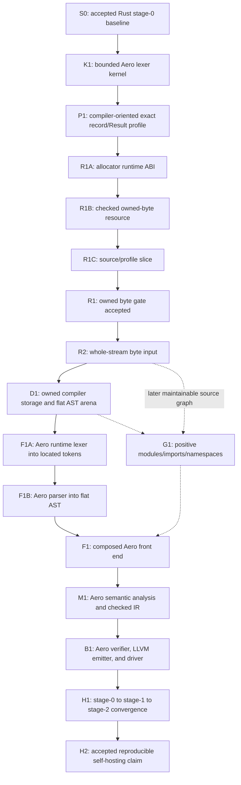

# Aero Self-Hosting Roadmap

Last reviewed: 2026-08-16 (America/New_York)

This is the canonical dependency path from Aero's current Rust bootstrap
compiler to a reproducible Aero-authored compiler. It records gates, not dates.
The current accepted baseline is CAP-041/F1A merge
`4bdfcb206f541356aa83987084a9d2feffbe511c`, tree
`5bfe506bfc6714e32f6453ad5ddc233923298b54`. CAP-042/F1B is the current
product-only flat-AST parser candidate on that baseline. It is not accepted
public capability until its complete local and protected gates finish.

For current feature truth, use
[`SPEC_IMPLEMENTATION_MATRIX.md`](SPEC_IMPLEMENTATION_MATRIX.md) and
[`PROJECT_STATE.md`](PROJECT_STATE.md). For the founding direction and broader
roadmap, use [`FRAMEWORK_ALIGNMENT.md`](FRAMEWORK_ALIGNMENT.md) and
[`Roadmap.md`](Roadmap.md). Exact task authorization remains in
[`TASK_LEDGER.md`](TASK_LEDGER.md).

## What counts as self-hosting

Aero is self-hosted only when all of the following are true:

1. The compiler implementation used for the claim is authored in Aero.
2. The trusted Rust stage-0 compiler builds that source into a stage-1 Aero
   compiler.
3. Stage 1 compiles the same canonical Aero compiler source into stage 2 without
   calling the Rust compiler for lexing, parsing, semantic analysis, checked IR,
   verification, or code generation.
4. Stage 1 and stage 2 satisfy a comparison contract frozen before the claim.
   The target is byte-identical compiler-emitted LLVM plus a canonical linked
   artifact manifest; any deliberately ignored platform metadata must be named
   and independently checked.
5. Both stages pass the same compiler conformance, negative-program,
   source-to-native, and clean-checkout system gates on every claimed platform.
6. The complete trust base is listed: stage 0, the Aero runtime, LLVM/Clang,
   linker, operating-system interfaces, and bootstrap scripts or source-bundle
   tooling.

An Aero-written lexer sample, accepted syntax, generated LLVM text, an Aero
wrapper around Rust compiler logic, or a compiler-shaped benchmark is not
self-hosting. Those can be valuable checkpoints only when labeled precisely.

## Current position

The project remains bootstrapped by the accepted Rust stage 0, and **K1 is now
accepted**: the repository tracks an Aero-written
function that scans a source-embedded `[int; 64]` and logical length into 24
fixed token-kind/start/length records. An independent Rust oracle covers 18
valid and invalid fixtures, the public exact-profile routes pass, deterministic
LLVM is verified, protected Linux and Windows O0/O2 native execution returns 91
with empty output, and candidate plus post-merge gates are green. No compiler
production file changed. K1 remains fixed-storage evidence, not runtime source
ingestion, dynamic token storage, Unicode lexing, a production-lexer
replacement, or self-hosting.

**P1 is accepted.** CAP-032 added the explicit
`exact-i32-record-result-v0` post-semantic profile and its tracked nested-record,
typed-Result, exhaustive-Match product. Exact recursive `i32` LLVM runs at O0
and O2 with silent exit 91 on Linux and Windows; closed negative boundaries and
all three earlier profiles remain frozen. Protected candidate
`2adea758c5b6045d83e24d053d4d06aaf765617f` merged as
`ce70f795e17a2da10253048c587cb475582c3f50`; their trees are identical, all 12
candidate checks passed, and post-merge CI, Rust CI, CodeQL, and accepted-head
evidence runs are green. Adding the fourth public Rust enum variant requires
downstream exhaustive matches to add the new arm or a catch-all.

The first hard runtime blocker is **R1: owned bytes**. Legacy Vec-shaped IR names
exist in [`ir.rs`](src/compiler/src/ir.rs), but the checked verifier and backend
deliberately reject every Vec instruction. They are dormant historical surface,
not an allocator, collection contract, or implementation. Accepted ordinary
source LLVM declares `printf` and conditional `llvm.trap` but emits no allocator
or file-read call; R1A's accepted runtime is therefore unreachable from source.
Accepted source probes also show that
`Vec::new()` is parsed as an unresolved enum constructor while `vec![]` is
erased into fixed-array syntax. CAP-035 now freezes the three-step readiness
route in [`OWNED_BYTE_BUFFER_READINESS.md`](OWNED_BYTE_BUFFER_READINESS.md): R1A
runtime ABI, R1B checked resource/verifier/backend, then R1C source/profile.

**R1A is accepted.** Candidate
`9a422eed653a9e0a80fdf264a50cc68d9d42c16a` merged as
`d3ec5a5c460a307a95f986b40ce3da1924c52cf0`; their trees are identical, all 12
candidate checks passed, and the merge's CI, stable/nightly Rust, Windows LLVM
22 native, CodeQL, and accepted-head evidence workflows are green. Its embedded
C11 runtime and deterministic test runtime establish the allocator/link
boundary without admitting source storage.

**R1B is accepted.** Candidate
`7ab0a7889f4ccb3011fb189e8112b692dc4b2142` merged as
`a9bd2e389d7baed28d6abefebd5267f2a37a4a49`; their trees are identical and
the exact merge's CI, stable/nightly Rust, Windows LLVM 22 native, CodeQL, and
accepted-head evidence workflows are green. R1B adds the private
`LogicalType::ByteBuffer`, eleven dedicated checked instructions, deterministic
resource identities, exact owner/loan control-flow verification, and verified
LLVM lowering to `%aero.byte_buffer = type { ptr, i32, i32 }`. Native tests prove
allocation, growth, byte reads, injected allocation/reallocation failure with
state preservation, exact-size deallocation, and no leaks. The full root gate
passes with 299 library and 35 binary tests plus every integration/native/system
target and doc tests. Parser, semantics, IR generation, public profiles, runtime
sources, and the CPU driver remain unchanged; no source program can construct
the resource at the R1B checkpoint.

**R1C and the bounded R1 owned-byte gate are accepted.** Candidate
`0b30e1f923b7f349011d8e8f5b9750146b305274` merged as
`cc75e2caa888a52f9d1c79bf806bb041b64a0a77`; their trees are identical, all
candidate checks passed, and accepted-head CI, Rust CI, CodeQL, and evidence
runs `31915409139`, `31915409157`, `31915409048`, and `31915409130` are
terminal-success. R1C adds the fail-closed
`exact-i32-byte-buffer-v0` profile, dedicated source type `ByteBuffer`, and the
five exact free functions `bytes_new`, `bytes_push`, `bytes_len`,
`bytes_capacity`, and `bytes_get`. The source slice permits only explicitly
typed direct function-local owners, local moves outside conditional/loop
topology, immediate nonescaping loans, typed `Result<int, int>` errors, and
compiler-inserted reverse-order cleanup. Independent checked-IR generation
revalidates that boundary and emits only accepted R1B instructions; the R1B
verifier remains the final resource authority. The candidate's full root gate
passes 306 library tests, 35 binary tests, every integration/native/system
target, and doc tests. The focused source product verifies under LLVM 22, runs
silently with exit 91 at O0/O2 and through the public CLI, maps deterministic
allocation/read failures, proves exact cleanup counters and zero leaks, rejects
accelerator routes before artifacts, and freezes every earlier profile. R1C
does not provide host input, text, general collections, compiler data arenas,
or self-hosting.

**R2 is accepted.** Candidate
`c020d477f6bfd188b0008249b8287d4d6d5051c5` merged as
`5c791393be5a251c187274d591174f7667866886`; their tree is identically
`06ee7ada90315432ce26d706f348685e2ee5458f`. All 13 candidate checks and the
accepted-head CI `31918179906`, Rust CI `31918179914`, CodeQL `31918179970`,
and evidence `31918179909` are terminal-success. The separate
`exact-i32-byte-input-v0` profile admits only a direct zero-argument
`stdin_read_byte()` initializer in an explicitly typed `Result<int, int>`
binding. Production C preserves binary bytes and sticky EOF/I/O sentinels; one
verified scalar instruction lowers to the conditional runtime call. The Aero
product owns the EOF loop and accepted ByteBuffer growth. R2 remains binary
stdin only, not path/file input, text, or a frontend.

**D1 is accepted.** CAP-040 changes no compiler production or runtime file. One tracked
Aero product owns five accepted ByteBuffers for input, canonical name spans,
token records, an append-only scope log, and a flat AST arena. Exact
little-endian word records, 1-based IDs, reverse scope lookup, and strict
lower-child node IDs provide deterministic construction and cycle-free
validation. An independent Rust oracle covers allocation failure, malformed
input, corrupted topology, 1,025 tokens, and 2,049 nodes. The focused target is
3/3 green with LLVM 22, O0/O2, CLI, and Linux/Windows workflow contracts. The
complete root gate passes formatting, correctness Clippy, 309 library tests,
35 binary tests, every integration/native/system target, and doc tests. Reviewed
candidate `f712800a23b622fb589d6af089b4c35b529faf90` merged as
`104d72dfb78921db68421c7ebd45e30dcbc3d804`; their tree is identically
`abd136d0cbc9066714148e0919010a697ccd350e`. Every candidate check and
accepted-head CI `31920949979`, Rust CI `31920949994`, CodeQL `31920949457`,
and evidence `31920949972` are terminal-success. See
[`COMPILER_STORAGE_READINESS.md`](COMPILER_STORAGE_READINESS.md).

**F1A is accepted.** CAP-041 composes unchanged R2 stdin and D1 storage in one
Aero-authored runtime ASCII lexer. It retains source bytes, interns canonical
name spans, emits six-word located token records, validates the complete state,
and compares an independent checksum. The focused 3/3 target covers
differential kinds/locations, malformed and bounded inputs, allocator failure,
LLVM 22, O0/O2, public CPU execution, accelerator artifact hygiene, and Linux/
Windows workflow contracts. K1/R1C/R2/D1 neighboring targets remain green.
The complete root gate and protected candidate/merge/accepted-head workflows
are green. Reviewed candidate `9e6e4cf87fe4a520afaf196790b5361a255056d9`
merged through PR #83 as `4bdfcb206f541356aa83987084a9d2feffbe511c`;
their tree is identically `5bfe506bfc6714e32f6453ad5ddc233923298b54`.
F1A alone is not a parser and does not close F1. See
[`AERO_FRONTEND_READINESS.md`](AERO_FRONTEND_READINESS.md).

**F1B is locally implemented as the CAP-042 candidate.** The same Aero product
preserves F1A token production, then parses its retained records with iterative
value/operator stacks into one-based, lower-child D1 nodes for a frozen
single-function expression grammar. No Rust compiler, runtime, profile, IR, or
backend production file changes. The canonical 42-byte source yields 2 names,
22 real tokens, 13 nodes, root 13, checksum 846139, and silent native exit 91.
Independent parsing, mutation, capacity, allocation, LLVM 22, O0/O2, public
CPU, accelerator-hygiene, and Linux/Windows replay controls are part of the
candidate gate. The focused target is 4/4 green and accepted F1A/D1 neighboring
targets are 3/3 green locally. The complete D:-redirected root gate passes 309
library tests, 35 binary tests, every integration/native/system target, and doc
tests. F1B is not accepted until protected publication and accepted-head replay
finish; it supplies syntax only, not M1 semantics.

## Dependency path

K1 is executable specification work, not a substitute for R1 or R2. A first
single-file or deterministically bundled bootstrap compiler may proceed before
the complete G1 module graph, provided the bundle step is non-semantic,
reproducible, declared in the trust base, and does not call the Rust compiler.
Positive modules remain required before Aero can claim a maintainable native
compiler project rather than only a bootstrap bundle.

## Stage gates

| Stage | Status | Required product | Evidence to advance | Explicit non-claim |
|---|---|---|---|---|
| S0 — trusted bootstrap baseline | **Accepted** | Protected Rust compiler checkpoint with one checked preparation route, independent checked-IR verification, deterministic selected-profile LLVM, and native gates | Exact accepted commit/tree, full root gate, stable/nightly, Windows LLVM 22, CodeQL, and accepted-head workflow evidence | The Rust compiler is not self-hosted and the whole language is not stable |
| K1 — bounded compiler kernel | **Accepted** | Aero function that lexes a fixed ASCII buffer and logical length into fixed `[status, count, kind, start, length, ...]` storage | Independent Rust oracle; 18 valid/invalid fixtures; deterministic verified LLVM; protected Linux/Windows O0/O2 native parity; exact candidate/merge/post-merge evidence | No runtime text, file input, Unicode, dynamic tokens, production-lexer replacement, or self-hosting |
| P1 — selected compiler subset | **Accepted** | A post-semantic exact profile for the frozen record, concrete `Result`, exhaustive `Match`, flat exact-array, `int`, and `bool` surface | Red-first pre-IR admission; exact root/function context; CAP-030 surface witness consumption; CAP-029 authentication; CAP-026 exact layout; unchanged existing profiles; protected Linux/Windows O0/O2 product exits 91 | No general enums, generics, references, modules, allocation, ABI, or broad stability |
| R1 — owned bytes | **Accepted** | One byte-specific owned growable buffer with length, capacity, initialized range, allocation failure, move, alias, reallocation invalidation, and exactly-once destruction contracts | Accepted R1A runtime/failure ABI; R1B checked ownership identity and verifier corruption matrix; R1C source negatives/product; allocation-failure/drop counters; protected Linux/Windows replay | This is one bounded owner, not Vec/String/general collections, input, or a memory-safety claim |
| R2 — host byte input | **Accepted** | Deterministic whole-stream binary stdin ingestion through an Aero-owned EOF loop and accepted ByteBuffer | Empty/short/large input, partial prefix then failure, sticky EOF/I/O, binary sentinel bytes, verifier corruption, LLVM 22, O0/O2, and protected Linux/Windows replay | Stdin bytes are not file/path I/O, text decoding, modules, or a production frontend |
| D1 — compiler data model | **Accepted** | Five Aero-owned byte stores for input, interned name spans, token records, a scope log, and a flat append-only AST arena using integer node IDs | Independent oracle; exact allocation/failure/drop evidence; cycle-free arena validation; deterministic iteration; 1,025-token/2,049-node stress; no host collection substitution; complete local and protected replay green | This bounded serialized product is not general collections or replacement of the Rust `String`/`Vec`/`Box` AST |
| F1A — runtime lexer | **Accepted** | Aero runtime ASCII scanner consuming R2 bytes and emitting D1-style canonical names plus located token records | Independent and Rust-overlap oracles; malformed/boundary corpus; allocator failure; deterministic LLVM; protected Linux/Windows O0/O2 and public-run replay | Located token production is not parsing or replacement of the Rust front end |
| F1B — flat-AST parser | **Locally root-green candidate; public acceptance pending** | Iterative Aero parser consuming F1A records and emitting D1 nodes for one frozen function/expression grammar | Independent parser oracle; Rust overlap without expected-node authority; malformed/boundary and mutation corpus; exact cleanup; deterministic LLVM; Linux/Windows O0/O2 replay | Syntax nodes are not name/type/ownership analysis, checked IR, or a production-front-end replacement |
| G1 — source graph | **Future; may trail first bundled bootstrap** | Positive modules/imports, namespaces, collision and cycle rules, visibility, canonical file identity, and deterministic traversal | Multi-file positive/negative corpus, cycle and ambiguity diagnostics, cache identity, cross-platform path rules | Current direct module collection and parsed-but-rejected imports are not this gate |
| F1 — Aero front end | **Future** | Aero lexer and parser consuming R2 bytes and producing D1 tokens/AST with deterministic locations and diagnostics | Differential oracle against the accepted grammar; malformed-source corpus; fuzz/property tests; bounded-memory failure behavior | K1's fixed kernel is not the production front end |
| M1 — semantic compiler core | **Future** | Aero name/type/ownership analysis, normalized profile facts, checked IR construction, and fail-before-backend behavior | Differential valid/invalid corpus; checked-IR structural equality or frozen equivalence; corruption controls; determinism | Parsing success does not prove semantics or ownership safety |
| B1 — trusted Aero backend path | **Future** | Aero checked-IR verifier, deterministic LLVM emitter, and a driver that invokes the declared LLVM/link trust base | Invalid IR rejection, LLVM verifier, O0/O2 object lowering, native system corpus, artifact hygiene | Emitting plausible LLVM without independent verification is not a compiler gate |
| H1 — bootstrap convergence | **Future** | Stage 0 builds stage 1; stage 1 builds stage 2 from the same canonical Aero compiler source | Clean isolated builds, frozen environment/toolchain manifest, raw LLVM comparison, canonical linked-artifact comparison, repeated-build equality | A single successful stage-1 build is not convergence |
| H2 — accepted self-hosting | **Future** | Protected, reproducible H1 result plus the complete declared platform and conformance surface | Immutable manifests/artifacts, independent replay, exact candidate/merge identity, post-merge replay, truthful documentation | No stability, memory-safety, performance, accelerator, or release claim follows automatically |

## Current gaps and their owners

| Gap | Current repository evidence | Owning work before the gate can close |
|---|---|---|
| Runtime-sized source bytes | Accepted R1 supplies owned runtime-sized storage and accepted R2 feeds it verified binary stdin bytes. | Preserve R1/R2 unchanged; file/path input remains a separate later contract |
| Allocation and destruction | Accepted R1A supplies the replaceable CPU allocator/link object, accepted R1B supplies verified resource IR/backend lowering, and accepted R1C produces that IR only from the bounded source owner with exact cleanup. | D1 composes those owners without changing allocation or destruction authority |
| Owned text and names | The Rust lexer builds `String` values and returns `Vec<LocatedToken>`; D1 stores only canonical ASCII spans into its live input owner. | F1 must freeze source encoding and diagnostics; owned UTF-8 remains separate |
| Recursive compiler data | `ast.rs` uses `String`, `Vec`, and `Box` throughout expressions, statements, patterns, types, and blocks; local D1 instead proves a flat integer-ID arena. | Protect D1, then have F1 emit that bounded shape before M1 expands the model |
| Compiler-safe selected surface | Accepted `exact-i32-byte-input-v0` composes exact integers, records/Result, ByteBuffer, and scalar stdin while freezing every earlier profile. | D1 uses the accepted profile unchanged; F1 requires its own ledger-first grammar/product contract |
| Input errors and typed failure | Accepted R2 maps byte/EOF/I/O sentinels into concrete `Result<int, int>` and rejects inferred/nested/discarded uses before IR. | Preserve this mapping when F1 consumes input; no failure may become a byte/token |
| Modules and names | Root `mod` collection is flattened and bounded; executable imports, namespaces, visibility, recursive graphs, cycles, and separate compilation are absent. | G1 after owned bytes/names and deterministic collections; a declared single-file bootstrap may precede it |
| Front-end fidelity | The production lexer/parser remain Rust. Accepted F1A lexes runtime ASCII into located owned records; local CAP-042/F1B consumes those exact records into a bounded D1 flat AST. | Protect F1B, then freeze the bounded F1 handoff to M1 without extending the grammar implicitly |
| Semantic and ownership fidelity | The Rust semantic analyzer uses multiple scopes, registries, maps, fixed-point ownership state, and normalization authorities. | M1 must port bounded authorities with differential and corruption evidence rather than re-infer convenient types |
| Checked IR and verification | Current checked IR and verifier are trusted Rust authority. | M1 constructs it; B1 independently verifies it before emission |
| Code emission and driver | LLVM text, cache, CLI, process execution, object lowering, and linking are Rust-owned. | B1 plus a narrow runtime/process/file contract; LLVM and the linker can remain declared external tools |
| Bootstrap reproducibility | Product and claim evidence are reproducible, but no stage compiler or convergence manifest exists. | Freeze H1 comparison inputs, environment, ignored metadata, and failure rules before the first stage build |
| Cross-platform trust | Existing Linux and Windows gates cover bounded accepted programs, not an Aero compiler executable. | Every bootstrap stage must run the same corpus on each claimed host; CPU self-hosting does not imply ROCm/CUDA execution |

## Minimum compiler subset

The bootstrap compiler should target the smallest source subset that can express
the compiler correctly, not all experimental Aero syntax. Its contract must be
selected explicitly and fail closed before IR. Expected ingredients are:

- exact `int`/`i32`, `bool`, fixed byte/int buffers, records, concrete typed
  failure, exhaustive `Match`, loops, and ordinary nongeneric calls;
- owned byte buffers and deterministic flat arenas;
- no implicit conversion, fallback typing, hidden Rust collection, or unchecked
  allocator path;
- ASCII source first if frozen as such, with Unicode deferred rather than
  partially claimed;
- CPU execution first; ROCm and CUDA remain separate capability programs.

This list is a dependency target, not blanket authorization for R1 runtime
semantics. CAP-035 freezes the bounded route; each behavior-changing R1A/R1B/R1C
slice still requires its own ledger and failing regression first.

## Evidence checklist for every bootstrap checkpoint

- Exact accepted base commit and tree.
- Frozen positive behavior, negative boundary, allowed files, risks, and stop
  conditions in `TASK_LEDGER.md`.
- A failing regression before any behavior change.
- Independent oracle or corruption control; self-checks alone are insufficient.
- Focused tests, neighboring compatibility rings, formatting, correctness
  Clippy, `git diff --check`, and `./tools/test.sh`.
- Deterministic emitted artifacts and empty/unrequested-artifact checks.
- Linux and Windows native evidence for every claimed CPU product.
- Exact candidate, protected merge, and post-merge workflow identities.
- Explicit remaining exclusions and no automatic stability, safety,
  performance, accelerator, or release promotion.

## Exact next task

Finish validation and protect **CAP-042/F1B flat-AST parser** from exact
accepted F1A head `4bdfcb206f541356aa83987084a9d2feffbe511c`.
Preserve its ledger-first `376dfa0` and red-first `b513fba` checkpoints, run the
candidate workflows, protected merge, and accepted head without changing
compiler production, runtime, or accepted F1A/D1 behavior. Its focused,
neighboring, complete D:-redirected gates and exact eight-file scope are green.

After F1B acceptance, record the bounded F1 handoff and authorize M1 only under
a separately frozen semantic and checked-IR contract. Do not call the Rust
front end replaced—or the project self-hosted—before M1, B1, and H1/H2
independently close.

## Deliberately absent schedule

This roadmap does not estimate calendar time. Progress is measured by accepted
dependency gates because implementation speed does not remove semantic,
ownership, verification, or reproducibility obligations.
